# LiftLine

> **AI-powered elevator service dispatch with intelligent routing, voice intake, and automated technician assignment**

LiftLine is a production-ready phone intake and dispatch system for elevator maintenance. It combines type-safe AI routing, voice interaction, and multi-channel notifications to automate the entire service request workflow—from safety triage to technician dispatch.

## 🎯 Key Features

- **Safety-First Triage** — Immediate dispatcher routing for entrapment, injury, or danger keywords
- **Type-Safe AI Routing** — TypeSafe Jev makes confident, auditable decisions on data source selection
- **Voice & Keypad Interface** — Natural speech recognition with fallback to DTMF input
- **Multi-System Integration** — Unified access to CRM, SAP, IoT telemetry, and field service data
- **Automated Dispatch** — Intelligent technician matching based on certification, availability, and location
- **Warranty & Coverage** — Real-time validation of service agreements and billable callout approval
- **Durable Notifications** — Retry-safe outbox with iMessage delivery via Photon Spectrum
- **Security Hardened** — PIN verification, signed webhooks, redacted logs, and protected APIs

## 🚀 Quick Start

```sh
# Run the interactive demo (no external services required)
python3 -m lift_agent demo

# Try different scenarios
python3 -m lift_agent demo --scenario entrapment
python3 -m lift_agent demo --scenario billable
python3 -m lift_agent demo --scenario clean
python3 -m lift_agent demo --scenario unauthorized

# Use live TypeSafe Jev routing (requires TYPESAFE_API_KEY)
python3 -m lift_agent demo --live-jev
```

Each demo run creates isolated SQLite databases, simulates the complete conversation flow, and prints a detailed routing trace. No real notifications are sent in demo mode.

## 🛠️ Tech Stack

### Core Infrastructure

- **Python 3.11+** — Backend service using only standard library (no external dependencies)
- **SQLite** — Embedded databases for CRM, SAP, IoT telemetry, and field service data
- **Node.js 22+** — Photon bridge service for iMessage notifications

### AI & Intelligence

- **[TypeSafe Jev](https://docs.typesafe.ai/api)** — Type-safe AI routing with confidence scoring and probability distributions
  - Structured Choice decisions (not conversational LLM)
  - 80%+ confidence threshold enforcement
  - Auditable routing trace with model version tracking
- **ElevenLabs** — Natural text-to-speech for voice responses (optional)

### Voice & Telephony

- **[Twilio Voice](https://www.twilio.com/docs/voice)** — Phone intake with TwiML state machine
  - Speech recognition with DTMF fallback
  - Webhook-driven conversation flow
  - Request signature validation for security

### Notifications

- **[Photon Spectrum](https://photon.codes/docs/spectrum-ts)** — iMessage delivery via `spectrum-ts` (v12.10.1)
  - Durable outbox pattern with retry logic
  - Consent-based messaging
  - Delivery status tracking

### Security & Reliability

- **PIN Hashing** — SHA-256 contact verification
- **Webhook Signatures** — Twilio request validation
- **Protected APIs** — Bearer token authentication for operator endpoints
- **Redacted Logging** — PII scrubbing in audit trails
- **Idempotent Webhooks** — Retry-safe state transitions

## 📋 How It Works

```mermaid
flowchart TD
    Start([📞 Incoming Call]) --> Safety{Safety Triage<br/>Danger/Entrapment?}

    Safety -->|Yes| Human[🚨 Route to Dispatcher<br/>Immediate Human Response]
    Safety -->|No| Machine[🔢 Collect Machine Number<br/>Speech + DTMF]

    Machine --> Confirm{Confirm<br/>Machine ID?}
    Confirm -->|Retry| Machine
    Confirm -->|Yes| PIN[🔐 Enter 6-Digit PIN<br/>Contact Verification]

    PIN --> Verify{Verify Identity<br/>Phone + PIN Hash}
    Verify -->|Failed| Human
    Verify -->|Success| Jev[🤖 TypeSafe Jev Routing<br/>7 Questions → 7 Sources]

    Jev --> JevCheck{Confidence<br/>≥80%?}
    JevCheck -->|No| Human
    JevCheck -->|Yes| Equipment[⚙️ Equipment Lookup<br/>SAP: Machine → Car + Controller]

    Equipment --> EquipCheck{Machine<br/>Valid?}
    EquipCheck -->|No| Human
    EquipCheck -->|Yes| Telemetry[📡 Telemetry Check<br/>IoT: Health + Freshness]

    Telemetry --> TelCheck{Telemetry<br/>Fresh?}
    TelCheck -->|Stale/Missing| Human
    TelCheck -->|Valid| Critical{Critical<br/>Events?}

    Critical -->|Entrapment/Safety| Human
    Critical -->|None| Describe[🎤 Describe Issue<br/>Speech Recognition]

    Describe --> Fault[🔍 Fault Analysis<br/>Field: Component Correlation<br/>Prior Repair Matching]

    Fault --> Coverage[📋 Coverage Check<br/>SAP: Warranty + Contract]

    Coverage --> Billable{Billable<br/>Callout?}
    Billable -->|Yes| Approve{Caller<br/>Approves Cost?}
    Approve -->|No| Decline[❌ Case Logged<br/>No Dispatch]
    Approve -->|Yes| Duplicate
    Billable -->|No - Covered| Duplicate

    Duplicate[🔎 Duplicate Check<br/>CRM: Active Cases]

    Duplicate --> DupCheck{Existing<br/>Case?}
    DupCheck -->|Yes| Human
    DupCheck -->|No| Dispatch[👷 Technician Match<br/>Field: Cert + Availability]

    Dispatch --> DispCheck{Technician<br/>Available?}
    DispCheck -->|No| Human
    DispCheck -->|Yes| Create[💾 Create Case<br/>Atomic: Case + Work Order + Outbox]

    Create --> Consent{Notification<br/>Consent?}
    Consent -->|No| Report1[📢 Voice Report Only<br/>Case Number + ETA]
    Consent -->|Yes| Queue[📬 Queue Notifications<br/>Photon: Caller + Tech + Dispatcher]

    Queue --> Report2[📢 Voice Report<br/>Case Number + Provisional ETA]

    Report1 --> End1([✅ Call Complete])
    Report2 --> Notify[📲 Send iMessages<br/>Durable Outbox + Retry]

    Notify --> DispAccept{Dispatcher<br/>Accepts?}
    DispAccept -->|Yes| FinalETA[⏱️ Update ETA<br/>Final Arrival Time]
    DispAccept -->|Pending| Wait[⏳ Awaiting Confirmation]

    FinalETA --> End2([✅ Workflow Complete])
    Wait --> End3([⏸️ Pending Acceptance])
    Decline --> End4([📝 Logged - No Action])
    Human --> End5([👤 Human Takeover])

    style Start fill:#4CAF50,stroke:#2E7D32,color:#fff
    style Human fill:#FF5722,stroke:#D84315,color:#fff
    style Jev fill:#2196F3,stroke:#1565C0,color:#fff
    style Create fill:#9C27B0,stroke:#6A1B9A,color:#fff
    style End2 fill:#4CAF50,stroke:#2E7D32,color:#fff
    style End5 fill:#FF9800,stroke:#E65100,color:#fff
```



### Workflow Summary

The voice experience is a **structured workflow**, not an open-ended chatbot. Jev makes typed routing decisions; all business logic remains deterministic and auditable.

**Key Decision Points:**

1. **Safety Triage** — Immediate dispatcher routing for entrapment, injury, or danger keywords
2. **Identity Verification** — Phone number matching + 6-digit PIN validation
3. **AI Routing** — Jev selects optimal data sources for 7 workflow questions across 4 systems
4. **Equipment Lookup** — Site-scoped machine resolution with telemetry freshness checks
5. **Fault Analysis** — Component correlation, follow-up event tracking, prior repair matching
6. **Coverage Validation** — Warranty evaluation, maintenance contract checks, billable approval
7. **Technician Dispatch** — Certification matching, availability checks, travel time estimation
8. **Notification Delivery** — Consent-based case reports and ETA updates via iMessage
9. **Dispatcher Confirmation** — Acceptance endpoint with final ETA and assignment lock-in

## 📁 Project Structure

```
lift_agent/
├── voice.py           # TwiML state machine & conversation flow
├── router.py          # TypeSafe Jev integration & routing logic
├── service.py         # Business logic: investigation, dispatch, coverage
├── store.py           # Database schemas & synthetic fixtures
├── server.py          # Twilio webhooks & operator APIs
└── notifications.py   # Durable outbox worker

integrations/photon/
└── server.mjs         # Photon Spectrum iMessage bridge

docs/
└── operations.md      # Production deployment guide

seed/                  # Synthetic data fixtures
tests/                 # Unit & integration tests
```

## 📊 Operator Dashboard

`python3 -m lift_agent serve` also serves a browser dashboard at the service root (e.g. `http://127.0.0.1:8080/`).
Open that URL, paste your `ADMIN_API_KEY` (from `.env`) into the **Admin API key** field, and click **Connect**. It
polls the same admin-protected `GET /api/report` endpoint the CLI's `report` command uses, every 2 seconds, across
four tabs:

- **Dashboard** — case/work-order/notification counters and tables at a glance.
- **How it decides** — the routing trace of every Jev decision made so far (question → chosen source → confidence),
  plus the fixed policy table showing which question is allowed to go to which source, and why.
- **Live calls** — one row per phone call, its current step in the voice state machine, and the data collected/
  verified so far — what's happening in the back end while a call is in progress.
- **Our database** — a read-only browser over the four attached SQLite stand-ins (SAP/CRM/IoT/field), table by table.
- **Logs** — routing decisions, notification outbox activity, and call events merged into one chronological feed.

No admin key, no data: the dashboard shell loads without one, but every tab stays empty until a valid key is
supplied — the same authorization `/api/report` already enforced.

### CLI Commands

```sh
# Create persistent synthetic data
python3 -m lift_agent seed

# View cases, work orders, and routing traces
python3 -m lift_agent report

# Start production server (requires .env configuration)
python3 -m lift_agent serve

# Process notification outbox manually
python3 -m lift_agent notify
```

## 🚀 Production Deployment

### Environment Setup

Copy `.env.example` to `.env` and configure:

```sh
# Required for live operation
TWILIO_AUTH_TOKEN=your_token
TWILIO_PHONE_NUMBER=+1234567890
DISPATCHER_PHONE=+1234567890
PUBLIC_BASE_URL=https://your-domain.com
TYPESAFE_API_KEY=your_key

# Photon iMessage (optional but recommended)
SPECTRUM_PROJECT_ID=your_project_id
SPECTRUM_PROJECT_SECRET=your_secret
PHOTON_BRIDGE_TOKEN=your_token

# Enable notifications in production
MODE=live
SEND_NOTIFICATIONS=true
```

### Start Services

```sh
# Backend server (port 8080)
python3 -m lift_agent serve

# Photon bridge (port 8081, optional)
cd integrations/photon
npm ci
npm start
```

### Twilio Configuration

Set incoming call webhook to:

```
POST https://your-domain.com/voice
```

See `docs/operations.md` for dispatcher acceptance endpoints, deployment limits, and production considerations.

## ✅ Testing

```sh
# Run full test suite
python3 -m unittest discover -s tests -v
```

**Test Coverage:**

- ✅ Primary happy path (warranty-covered repair)
- ✅ Entrapment scenario (immediate dispatcher routing)
- ✅ Billable callout (explicit approval flow)
- ✅ Clean resolution (no prior faults)
- ✅ Unauthorized caller (PIN mismatch)
- ✅ Stale telemetry detection
- ✅ Duplicate case prevention
- ✅ Webhook signature validation
- ✅ Retry-safe state transitions
- ✅ Consent-based notifications
- ✅ Jev routing failures

## 🎬 Demo Scenarios

Each scenario demonstrates different workflow paths:

| Scenario         | Description                                             |
| ---------------- | ------------------------------------------------------- |
| **Default**      | Warranty-covered repair with prior component fault      |
| **Entrapment**   | Safety keyword triggers immediate dispatcher routing    |
| **Billable**     | Out-of-warranty repair requiring explicit cost approval |
| **Clean**        | No prior faults; technician dispatched for new issue    |
| **Unauthorized** | PIN mismatch blocks automated processing                |

Demo data includes:

- **Machine 1002** (Car B) with door lock circuit faults
- **Priya** (authorized contact): `+15550100100`, PIN `246810`
- **Ravi** (certified technician) with 20-minute travel time
- Prior repair on **September 7, 2026** for the same component

## 🏗️ Architecture Highlights

### Type-Safe AI Routing

- Jev answers 7 workflow questions by selecting from 7 data sources
- 80%+ confidence threshold with probability distribution validation
- Expected answer allowlist prevents hallucinated sources
- Full routing trace with model version and confidence scores

### Durable Notification Pattern

- Atomic outbox writes with case/work-order creation
- Retry logic with exponential backoff
- Delivery status tracking (pending → sent → delivered → failed)
- Consent verification before sending

### Security Layers

1. **Twilio signature validation** — Prevents webhook spoofing
2. **PIN hashing (SHA-256)** — Contact verification without plaintext storage
3. **Bearer token auth** — Protected operator APIs
4. **PII redaction** — Logs scrub phone numbers and PINs
5. **HTTPS enforcement** — Production requires TLS

### Zero External Dependencies

The Python backend uses **only the standard library**:

- `http.server` for webhooks
- `sqlite3` for data persistence
- `urllib.request` for Jev API calls
- `hashlib` for PIN verification
- `hmac` for signature validation

No pip packages required for core functionality.

## 📚 Integration References

- **[TypeSafe Jev API](https://docs.typesafe.ai/api)** — Typed choices with calibrated confidence
- **[Twilio Voice](https://www.twilio.com/docs/voice/twiml/gather)** — Speech/keypad collection
- **[Twilio Security](https://www.twilio.com/docs/usage/security)** — Request signature validation
- **[Photon Spectrum](https://photon.codes/docs/spectrum-ts/getting-started)** — iMessage delivery
- **[ElevenLabs](https://elevenlabs.io/docs)** — Text-to-speech synthesis

---

**Built for the TypeSafe AI Hackathon** • September 26, 2026
